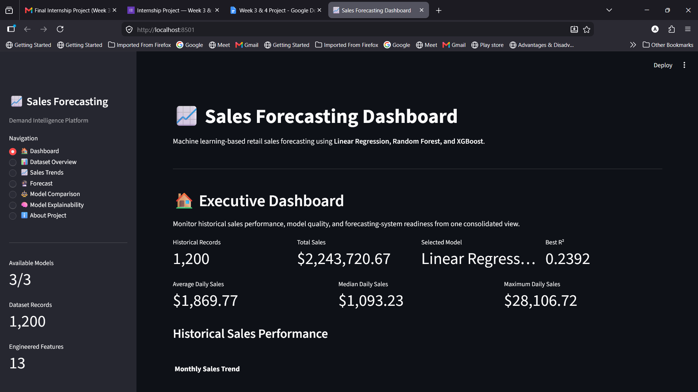
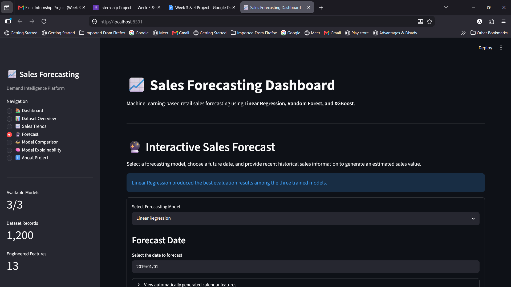
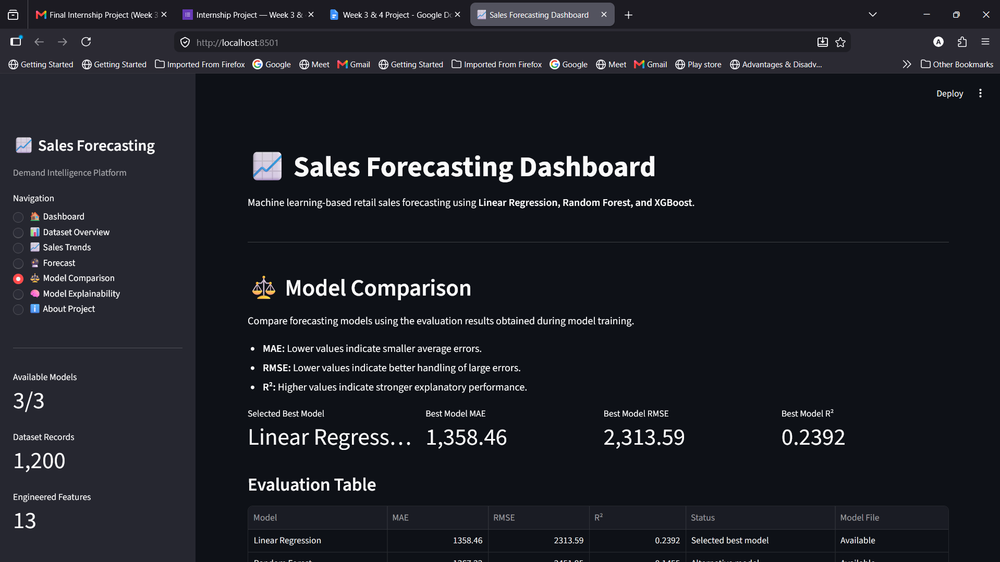
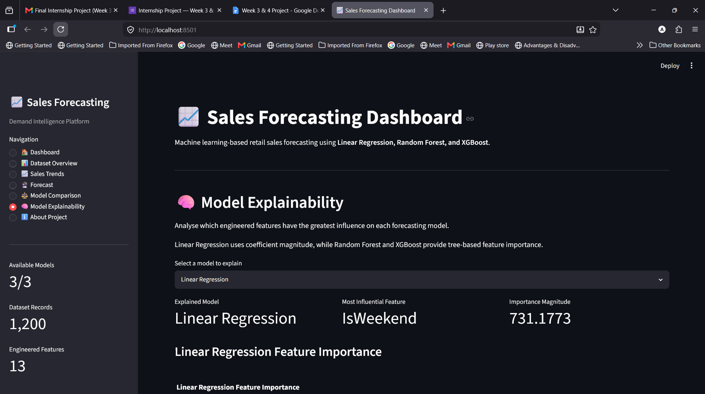

# 📈 Sales Forecasting and Demand Intelligence

An end-to-end machine learning project for analysing historical retail sales, engineering time-series features, comparing forecasting models, and generating interactive sales predictions through a Streamlit dashboard.

## Project Overview

This project develops a complete retail sales forecasting workflow, including:

- data preparation and cleaning
- exploratory sales analysis
- time-series feature engineering
- model training and evaluation
- model explainability
- interactive single-date forecasting
- business-focused dashboard development

The final system compares Linear Regression, Random Forest, and XGBoost models and uses the best-performing model for forecasting.

## Dashboard Preview

### Executive Dashboard



### Interactive Forecasting



### Model Comparison



### Model Explainability



## Business Problem

Retail sales can fluctuate because of seasonality, weekday behaviour, recent demand, and historical sales patterns.

The objective of this project is to create a machine learning system that can:

- analyse historical sales behaviour
- identify meaningful seasonal and temporal trends
- estimate future sales using engineered features
- compare multiple regression algorithms
- explain which features influence predictions
- support business users through an interactive dashboard

## Dataset

The processed forecasting dataset contains:

| Property | Value |
|---|---:|
| Forecasting observations | 1,200 |
| Engineered features | 13 |
| Target variable | Sales |
| Date range | 2015-02-14 to 2018-12-30 |

The forecasting dataset includes calendar, lag, and rolling-average variables.

## Engineered Features

### Calendar Features

- Year
- Month
- Quarter
- Week
- Day
- DayOfWeek
- DayOfYear
- IsWeekend

### Historical Sales Features

- Lag_1
- Lag_7
- Lag_30
- Rolling_Mean_7
- Rolling_Mean_30

### Target

- Sales

## Machine Learning Models

The following regression models were trained and evaluated:

1. Linear Regression
2. Random Forest Regressor
3. XGBoost Regressor

## Model Evaluation

| Model | MAE | RMSE | R² |
|---|---:|---:|---:|
| Linear Regression | 1358.46 | 2313.59 | 0.2392 |
| Random Forest | 1367.22 | 2451.95 | 0.1455 |
| XGBoost | 1405.12 | 2525.25 | 0.0937 |

## Final Model Selection

Linear Regression was selected as the final forecasting model because it achieved:

- the lowest MAE
- the lowest RMSE
- the highest R² score

This demonstrates that increased model complexity does not always produce better predictive performance.

## Model Explainability

The project includes feature-level interpretation for all three trained models.

- Linear Regression is interpreted using coefficient magnitude and direction.
- Random Forest is interpreted using feature importance scores.
- XGBoost is interpreted using feature importance scores.
- Cross-model importance values are normalised for fair visual comparison.

The explainability analysis shows that calendar behaviour, lag variables, and rolling averages contribute differently across the three algorithms.

## Dashboard Features

The Streamlit application contains the following pages:

### Executive Dashboard

- consolidated sales KPIs
- historical sales performance
- model performance summary
- business insights
- system status

### Dataset Overview

- dataset metrics
- dataset preview
- feature summary
- missing-value audit
- downloadable forecasting dataset

### Sales Trends

- configurable date filtering
- daily sales analysis
- monthly sales analysis
- yearly sales analysis
- weekday analysis
- quarterly sales analysis

### Forecast

- model selection
- automatic calendar-feature generation
- historical lag inputs
- rolling-average inputs
- single-date prediction
- input-range reliability checking
- forecast context comparison
- downloadable prediction history

### Model Comparison

- MAE comparison
- RMSE comparison
- R² comparison
- final model selection explanation

### Model Explainability

- Linear Regression coefficient analysis
- Random Forest feature importance
- XGBoost feature importance
- normalised cross-model comparison
- business interpretation

## Project Workflow

1. Loaded and cleaned raw retail sales data.
2. Created processed sales datasets.
3. Performed exploratory data analysis.
4. Aggregated daily, weekly, monthly, and yearly sales.
5. Created calendar-based forecasting variables.
6. Generated lag and rolling-average features.
7. Trained Linear Regression, Random Forest, and XGBoost.
8. Evaluated models using MAE, RMSE, and R².
9. Performed model explainability analysis.
10. Developed an interactive Streamlit dashboard.
11. Prepared the project for deployment and portfolio presentation.

## Repository Structure

```text
SalesForecasting_AnushkaDas/
│
├── assets/
│   └── screenshots/
│
├── charts/
│
├── dashboard/
│   └── app.py
│
├── data/
│   ├── processed/
│   └── raw/
│
├── models/
│   ├── linear_regression.pkl
│   ├── random_forest.pkl
│   └── xgboost.pkl
│
├── notebooks/
│   ├── 01_Data_Preparation.ipynb
│   ├── 02_Exploratory_Data_Analysis.ipynb
│   ├── 03_Forecasting_Data_Preparation.ipynb
│   ├── 04_Feature_Engineering.ipynb
│   ├── 05_Linear_Regression_Forecasting.ipynb
│   ├── 06_Random_Forest_Forecasting.ipynb
│   ├── 07_XGBoost_Forecasting.ipynb
│   └── 08_Model_Explainability.ipynb
│
├── reports/
│   └── Final_Project_Report.md
│
├── architecture.md
├── LICENSE
├── README.md
├── requirements.txt
└── .gitignore
```

## Technology Stack

| Category | Technology |
|---|---|
| Programming | Python |
| Data processing | Pandas, NumPy |
| Machine learning | Scikit-learn, XGBoost |
| Visualisation | Plotly, Matplotlib |
| Dashboard | Streamlit |
| Model storage | Pickle |
| Development | VS Code, Jupyter |
| Version control | Git, GitHub |

## Installation

Clone the repository:

```bash
git clone https://github.com/AN-ai-del/sales-forecasting-demand-intelligence.git
```

Move into the project folder:

```bash
cd sales-forecasting-demand-intelligence
```

Create a virtual environment:

```bash
python -m venv .venv
```

Activate the environment on Windows:

```bash
.venv\Scripts\activate
```

Install dependencies:

```bash
pip install -r requirements.txt
```

## Run the Dashboard

```bash
python -m streamlit run dashboard/app.py
```

The application will normally open at:

```text
http://localhost:8501
```

## Current Limitations

- The forecasting dataset contains only 1,200 observations.
- Large sales spikes remain difficult to predict.
- External factors such as promotions, holidays, prices, and inventory are not included.
- The dashboard currently generates single-point estimates.
- Forecast quality depends on the historical lag inputs supplied by the user.

## Future Improvements

- add promotion, price, inventory, and holiday variables
- implement chronological cross-validation
- perform systematic hyperparameter optimisation
- add SHAP-based local explanations
- support multi-day recursive forecasting
- generate confidence intervals
- connect the system to a live database
- add automated model retraining
- deploy the application using Streamlit Community Cloud
- introduce CI/CD using GitHub Actions

## Business Value

The project demonstrates how historical retail data can be converted into practical demand intelligence.

Potential business applications include:

- sales planning
- inventory preparation
- demand monitoring
- seasonal analysis
- model-assisted decision support
- identification of high-demand periods
- comparison of forecasting strategies

## Author

**Anushka Das**

AI and Machine Learning portfolio project.

GitHub: [AN-ai-del](https://github.com/AN-ai-del)

## License

This project is licensed under the MIT License.