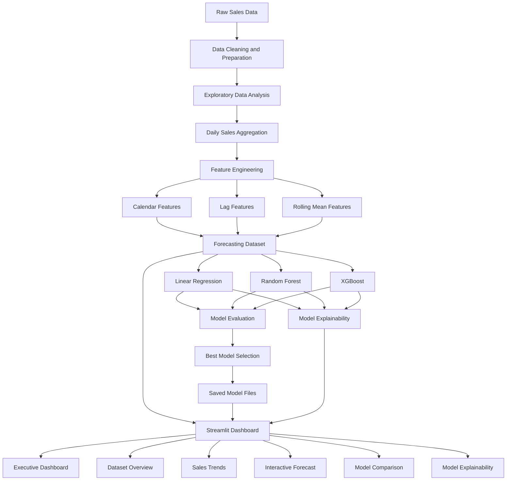

# System Architecture

## Overview

The Sales Forecasting and Demand Intelligence project follows a modular machine learning workflow that separates data preparation, feature engineering, model development, explainability, and dashboard presentation.

The system transforms raw retail sales data into a processed forecasting dataset, trains multiple regression models, compares their performance, and exposes the final forecasting workflow through an interactive Streamlit dashboard.

## Architecture Diagram



## Main Components

### 1. Raw Data Layer

The raw dataset is stored inside:

```text
data/raw/
```

This layer contains the original retail sales files before transformation.

### 2. Data Preparation Layer

Data preparation is performed in the early notebooks.

Responsibilities include:

- loading source data
- cleaning invalid records
- converting date columns
- handling missing values
- validating numerical columns
- aggregating sales by date
- saving processed datasets

Processed files are stored inside:

```text
data/processed/
```

### 3. Exploratory Analysis Layer

The exploratory analysis stage identifies:

- overall sales distribution
- sales trends over time
- monthly and yearly behaviour
- product and category performance
- regional patterns
- unusual sales spikes
- seasonal behaviour

Generated charts are stored inside:

```text
charts/
```

### 4. Feature Engineering Layer

The forecasting dataset contains three major feature groups.

#### Calendar Features

```text
Year
Month
Quarter
Week
Day
DayOfWeek
DayOfYear
IsWeekend
```

These features represent seasonal and calendar-based patterns.

#### Lag Features

```text
Lag_1
Lag_7
Lag_30
```

These features represent earlier observed sales values.

#### Rolling Features

```text
Rolling_Mean_7
Rolling_Mean_30
```

These features represent recent average demand.

### 5. Model Development Layer

Three regression models are trained independently:

- Linear Regression
- Random Forest Regressor
- XGBoost Regressor

Each model receives the same engineered feature set and predicts the same target:

```text
Sales
```

The trained models are stored inside:

```text
models/
```

### 6. Model Evaluation Layer

The models are evaluated using:

- Mean Absolute Error
- Root Mean Squared Error
- R² score

The evaluation results are used to compare predictive performance and select the final model.

Linear Regression was selected because it achieved:

- the lowest MAE
- the lowest RMSE
- the highest R²

### 7. Explainability Layer

The explainability workflow interprets model behaviour through:

- Linear Regression coefficients
- Random Forest feature importance
- XGBoost feature importance
- normalised cross-model feature comparison

This layer helps explain which variables influence sales predictions and how different algorithms prioritise the same inputs.

### 8. Dashboard Layer

The Streamlit application is located at:

```text
dashboard/app.py
```

The dashboard loads:

- processed forecasting data
- trained model files
- saved evaluation results
- model explainability information

The application provides the following pages:

#### Executive Dashboard

Provides a consolidated summary of:

- dataset scale
- sales performance
- model quality
- business insights
- system readiness

#### Dataset Overview

Provides:

- dataset preview
- descriptive statistics
- missing-value audit
- downloadable CSV output

#### Sales Trends

Provides:

- date filtering
- daily sales analysis
- monthly sales analysis
- yearly sales analysis
- weekday analysis
- quarterly analysis

#### Forecast

Provides:

- model selection
- forecast-date selection
- automatic calendar-feature generation
- lag and rolling-average inputs
- sales prediction
- input-range reliability checking
- downloadable prediction history

#### Model Comparison

Provides:

- MAE comparison
- RMSE comparison
- R² comparison
- evidence-based final model selection

#### Model Explainability

Provides:

- coefficient analysis
- tree-based feature importance
- cross-model importance comparison
- business interpretation

## Data Flow

The complete data flow is:

```text
Raw Sales Data
    ↓
Data Cleaning
    ↓
Daily Sales Aggregation
    ↓
Feature Engineering
    ↓
Forecasting Dataset
    ↓
Model Training
    ↓
Model Evaluation
    ↓
Model Selection
    ↓
Model Explainability
    ↓
Streamlit Dashboard
```

## Folder Responsibilities

| Folder | Responsibility |
|---|---|
| `data/raw/` | Original source datasets |
| `data/processed/` | Cleaned and engineered datasets |
| `notebooks/` | Analysis, feature engineering, training, and explainability |
| `models/` | Saved trained machine learning models |
| `charts/` | Exported visualisations |
| `dashboard/` | Streamlit application |
| `assets/screenshots/` | Dashboard screenshots for documentation |
| `reports/` | Final project documentation |

## Technology Flow

```text
Pandas
  ↓
Feature Engineering
  ↓
Scikit-learn / XGBoost
  ↓
Pickle Model Storage
  ↓
Plotly Visualisation
  ↓
Streamlit Interface
```

## Design Principles

The architecture follows these principles:

- modular separation of responsibilities
- reproducible notebook workflow
- reusable trained-model files
- consistent feature ordering
- validation before prediction
- transparent model comparison
- business-oriented presentation
- portfolio-ready documentation

## Current Deployment Architecture

The current application runs locally using:

```bash
python -m streamlit run dashboard/app.py
```

The local Streamlit server serves the application at:

```text
http://localhost:8501
```

## Future Architecture Improvements

The system can later be extended with:

- a live SQL database
- automated data ingestion
- scheduled model retraining
- API-based prediction services
- Docker containerisation
- Streamlit Community Cloud deployment
- GitHub Actions CI/CD
- model monitoring
- drift detection
- multi-step forecasting
- SHAP-based local explanations